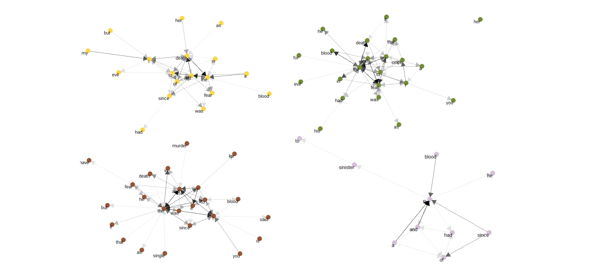
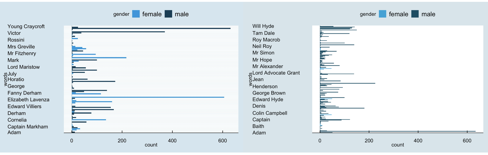
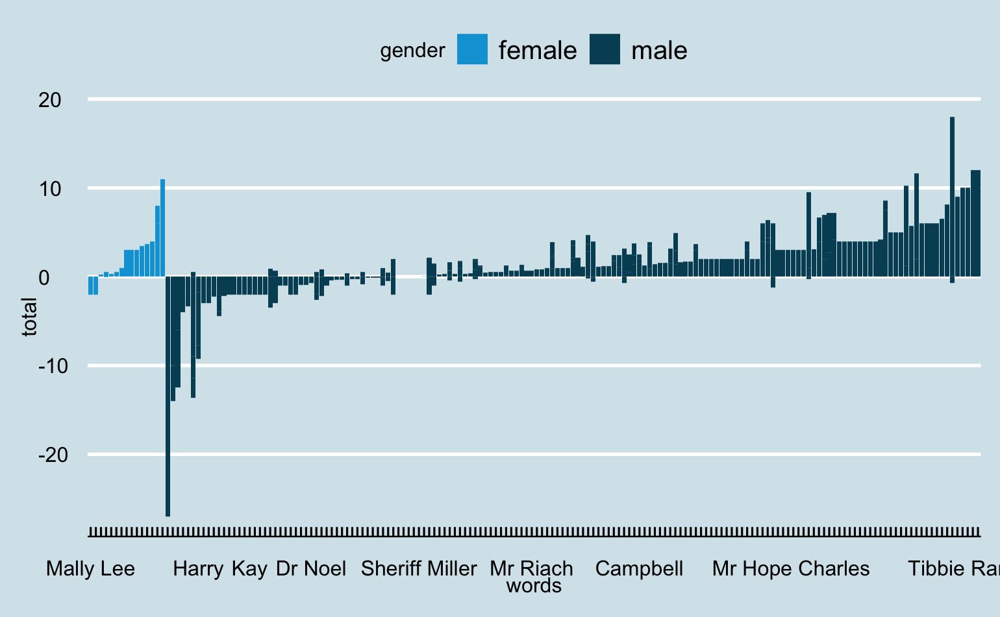

```{r setup, include=FALSE}
knitr::opts_chunk$set(echo = TRUE)
```

> **Research hypothesis: ** In classic horror, women face brutality with more severity than men do.


In this research project, we were given the task to analyse the sentiment of texts through coding and visualisations. We decided that the  genre of horror would be the most representative of emotions, and hence an interesting topic to explore for sentiment analysis. The authors we have selected for our corpora namely **Bram Stoker** (1947-19120), **H.P. Lovecraft** (1890-1937), **Mary Shelley** (1797-1851), and **R.L. Stevenson** (1850-1894) were all present at a time when women were heavily subjugated through all spheres of society. 

The National Woman Suffrage Association was fighting for women’s right to vote at this time in America, whereas the United Kingdom along with Ireland saw an improvement in living conditions, by virtue of which the marriage and birth rates were at a high. This resistance towards patriarchy is what interested us, especially since this time also saw the rise of The New Woman in literature, which piqued our curiosity as to how women were represented in art. The oppressive sentiments through which women are portrayed in literature is what made us ask the question - </br>


<center> *How is literature used to further subjugate women during a time of great resistance?* </center> </br>


Our research attempts to analyse the severity of atrocities faced by women in comparison to that faced by men in the context of horror, and to see how the portrayal of gender in this particular genre is geared towards patriarchal ideologies. 


## Corpus Description

For our corpora, we chose authors Mary Shelley, Bram Stoker, H.P. Lovecraft, and R.L. Stevenson. All our authors wrote novels that belong to the horror genre. We wanted to explore the advantages and limitations of sentiment analysis through this genre in order to gauge the intensity of emotions felt by characters in response to the atrocities faced by them in this particular context. Since our collection of authors is predominantly male, we decided to use gender as a parameter for our research, in order to analyse the discrepancies within the characters’ sentiments. Since the authors we have chosen did not write all their novels in the horror genre, we have selected documents within our corpora which we thought were more representative of the context we want to look into.

The corpus for H.P Lovecraft has a total of 105 documents, with the longest and shortest documents being The Case of Charles Dexter Ward and The Slaying of the Monster, respectively. The corpus has a total of 7,22,702 words. For Mary Shelley, our corpus contains 14 documents, with the longest and shortest documents being The Last Man and Prospine and Midas, respectively. The corpus has a total of 12,58,391 words. For R.L. Stevenson, there are a total of 17 documents in the corpus, with a total of 12,11,135 words. The longest and shortest documents being The Wrecker and Child’s Garden of Verses, respectively. Lastly, for Bram Stoker, there are 10 documents in the corpus, with a total of 9,85,348 words. The longest and shortest documents being The Dracula and The Watter’s Mou, respectively. In totality, our corpora of these four authors have 146 documents, with a total of 41,77,576 words.


## Summary

#### Collocations:

To simplify our workflow, we have used the 'tm' package in R to generate the pairwise count of word-pairs, and consequently collocations in the text. Establishing collocations require splitting the text up into discrete chunks (or 'locations'). In our analysis, we have set this atomic length of the text to 10 sentences. 

```{r, echo=FALSE, message=FALSE, , warning=FALSE}
library("tm")
library("SnowballC")
library("RColorBrewer")
library("syuzhet")
library("ggplot2")
library(tidytext)
library(dplyr)
library(tidyr)
library(scales)
library(ggthemes)
library(magrittr)
library(devtools)
library(stringr)
library(widyr)
library(fuzzyjoin)
library(readr)

#Graphics library
library(ggiraphExtra)
library(ggplot2)
library(RColorBrewer)
library(scales)
library(tidygraph)


```

```{r, echo=FALSE, message=FALSE, , warning=FALSE}
stoker_corpus <- read_csv("canons/stoker.csv") %>% unnest_tokens(text, text, token="sentences") %>% select(-author)
shelley_corpus <- read_csv("canons/shelley.csv") %>% unnest_tokens(text, text, token="sentences") %>% select(-author)
lovecraft_corpus <- read_csv("canons/lovecraft.csv") %>% unnest_tokens(text, text, token="sentences") %>% select(-author)
stevenson_corpus <- read_csv("canons/stevenson.csv") %>% unnest_tokens(text, text, token="sentences") %>% select(-author)
test_corpus <- read_csv("test.csv") %>% unnest_tokens(text, text, token="sentences") %>% select(-author)


## Pre-Processing for the Shelley Corpus
test_section_words <- test_corpus %>%
  filter(title == "Frankestein") %>%
  mutate(section = row_number() %/% 10) %>%
  filter(section > 0) %>%
  unnest_tokens(word, text) %>%
  filter(!word %in% stop_words$word)

shelley_section_words <- shelley_corpus %>%
  mutate(section = row_number() %/% 10) %>%
  filter(section > 0) %>%
  unnest_tokens(word, text) %>%
  filter(!word %in% stop_words$word)
```


**Some observations**:

* Collocations over the a general/diverse corpus doesn't yield interesting results. Most frequent collocations often include natural bi-grams or word pairs, such as *Lady Lodore* and so on
* Narrowing down on specific texts, we found some interesting results. As anecdotal evidence, we present the following collocations from Frankenstein, by Mary Shelley, where words such as *death* and *miserable* are often collocated with *elizabeth*, a prominent female character.

```{r, echo=FALSE, message=FALSE, warning=FALSE}
test_section_words %>% 
  pairwise_count(word, section, sort = TRUE) %>% 
  filter(item1 == "miserable" | item1 == "death" | item1 == "cry")
```

#### Corelations:

For correlations, we have used the 'ggraph' package in R. We have analysed texts from all four authors separately, as n-grams (n=3,4,5,6) and have visualised the results as a Markov Chain as shown below: 



**Some observations**:

* A Markov-Chain is directional, therefore we pay close attention to the directionality in the diagram
* In Shelley's Chain, we observe that the word *her* is most likely to be followed by *death*. In Stevenson's Chain, we observe an evident use of the first-person, who's identiying pronoun is often followed by *blood*, *murder* and *death*. Given Stevenson's tendency to mostly write about male characters (as will be established in the following section), it is probable that the perpertrators of these actions are men 

## Data Visualisations

To test our hypothesis, we first extracted the characters from the texts. This was done via Named Entity Recognition in R (specifically, the maxent entity annotator using the openNLP model in English). Since the NER library seems to have a strong bias for categorising words starting in capitals as Proper Nouns, we retained the case of the characters in our cleaning phase. 


#### Lack of Female Representation

One issue we ran into, especially with RL Stevenson and HP Lovecraft, is the scanty representation of female characters in general. Both authors had primarily male characters, as is evident in the visualisation below (Frequency of Character names in Lovecraft’s short stories (n=9)).



Things were a little better, in terms of gender representation, when it came to Shelley, for example, as shown above. As a consequence, much of the discussion that follows revolves around Shelley's Canonical Works. However, we note that similar results were seen across the other authors as well, for which we have provided some additional plots in the Appendix B. 

#### Binary Sentiments

Once we had these characters extracted, we manually cleaned the data to account for incorrect hits and duplicate entities. Then, we implemented a basic Sentiment Analysis using the NRC lexicon on our dataset. After doing so, and then aggregating them by sentences, we had the sentiments corresponding to characters in our texts. 


We observe that female characters have, on the average, a less positive sentiment in the context surrounding them. We note that there is no observable difference in the net negative sentiment between the genders) This particular visualisation displays the discrepancies in sentiment in a binary form. 

#### Beyond Binaries

An obvious caveat of this process is that character names are not nearly as frequent in texts as the pronouns used to describe them (as we’ve established before). Hence, we ran a similar sentiment analysis, but now grouped by male and female pronouns. In this visualisation, we can see how in Shelley’s work, women face more negative sentiments than men do, specifically the characters Elizabeth and Cornelia. 


#### What's in a name?

Following a similar path of investigation, we tried to map the sentiments of the words surrounding gendered pronouns in these texts. The rationale behind this was the fact that characters are seldom summoned by their names in texts, once they have been introduced. We hypothesized that using the pronoun as a proxy for the gendered character would yield insightful results. Unfortunately,  we observed that due to the sheer abundance of pronouns in the text, it is quite common for similar words to surround pronouns on both genders. Consequently, we observe that the sentiment is similar across all pronouns. The only interesting observation here was that male-gendered pronouns are 1.5 times more frequent than female-gendered pronouns - something we present as a factoid.


## Conclusion

In conclusion, after a lot of trial and error with visualisation tools, we were able to prove our hypothesis that women were, in fact, further subjugated by virtue of representation in literature during a time of great resistance. Our binary analysis shows how female characters had less positive sentiment surrounding them than male characters did. Additionally, our more in-depth analysis proved that female characters faced more complex emotions, such as sadness, fear, and anticipation, whereas the male characters were more inclined towards sentiments such as joy. Further visualisations also emerged as we saw that male characters were more likely to perpetrate atrocities and killings around them, leaving us with the inference that their female counterparts were the possible victims to these said atrocities. The victimisation of women in these novels show a clear hierarchy in the power dynamics between male and female characters, proving that the pervasive nature of patriarchal ideologies in literature were omnipresent even at a time when art saw the rise of The New Woman. 

## Reflection

As a language, R is very useful in general for statistical data analysis. Among many other reasons for this, R is naturally vectorised (that is, it performs operations on vectors and not individual elements) and has a very rich library support (such as tidyverse, ggplot etc) which make it convenient and quick to analyse and visualise data.

On the flipside, being developed primarily by and for statisticians, R isn’t as user friendly as Python. Assignment operations and 1-indexing are among the many syntactical anomalies in R which may be non-intuitive for people new to the language. Furthermore, while it has decent library support, it is yet to build the kind of ecosystem Python enjoys. As an example, cleanNLP doesn’t work with R. Being an interpreted language, it is also not particularly efficient or secure for real-life applications.

R gave us the flexibility to analyse the data exactly in the way we wanted to. We weren’t constrained by the plots and analyses available in Voyant. Among some of the things we accomplished in R (which aren’t easy in Voyant) were custom cleaning of metadata, sentiment analysis, entity recognition, data cleaning and so on. Among less important things, R allowed us to present our analysis in a more aesthetically appealing way than the default Voyant plots. It allowed us to fine-tune parameters much more than Voyant could.

While this may be a shortcoming of the language model we used in NER (openNLP), the Entity Recognition in R isn’t accurate and often leads to bad hits. We have noticed a tendency of the Maxent Entity Annotator to classify any noun beginning with a capital letter as a Proper noun. The Sentiment Analysis is also fairly primitive in R, as it is essentially implemented by trivial string comparisons. It doesn’t take into account various forms and multiple meanings of words in the English vocabulary. We believe this significantly affects the quality of results we get from R. Furthermore, more specific to our analysis, it was quite hard to establish the relations between various parts of speech with each other. For example, if “A inflicts harm on B”, it is hard to isolate the portrayed state of A and B without some form of an attention model (perhaps, like a Transformer). 


## Appendix 

### (A) Corpus Composition
#### Selected Canonical Works

**Mary Shelley** - 5 books

* **Frankenstein** - horror

* **Mathilda** (not horror but primarily deals with topics of incest faced by daughter, and her father’s eventual suicide by drowning, so there is a lot of scope for sentiment analysis)

* **Lordore**- volumes 1-3 (again not horror but deals with tragedy of husband’s death and obstacles faced by widow and daughter, scope for gender based sentiment analysis)

**RL Stevenson** - 4 books

* **Jekyll and Hyde** (Gothic, horror)

* **Kidnapped** (deals with death, miserly characters)

* **Catriona** - sequel to Kidnapped (deals with death, romance, imprisonment)

* **New Arabian Nights** (suicide, death, duels- scope for sentiment analysis)

**Bram Stoker** - 5 books

* **Dracula** - horror

* **The Lair of The White Worm** - horror

* **Lady Athlyne** (romance novel about women’s societal obstacles- scope for gender based sentiment analysis)

* **The Jewel of The Seven Stars** - horror (also deals with the rise of the New Woman i.e feminism- scope for gender based sentiment analysis)

* **The Man** - horror and romance

**HP Lovecraft** - 9 short stories, 1 book

* The Horror at Martin’s Beach
* The Horror in The Museum
* The Horror at Red Hook (death, cults, devil-worshipping)
* The Haunter of The Dark (aliens)
* The Hound (robbing graves, graphic imagery of decomposed bodies)
* In The Vault (fiction- man trapped in vault filled with coffins)
* The Curse of Yig - horror
* The Ghost Eater - horror
* The Evil Clergyman (posthumous excerpt from a letter written by HPL- deals with danger, suicide)
* The Mound (horror+science fiction novel - deals with slavery, death, body modifications, etc.)

### (B) Additional Plots
